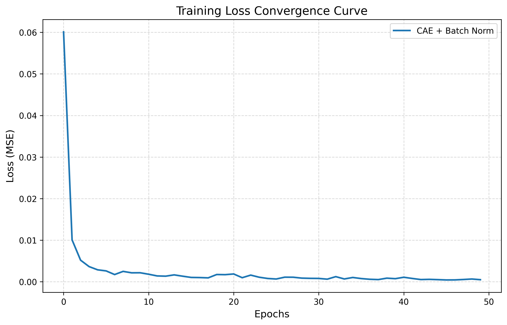

# 🤖 工业产品表面缺陷检测系统

本项目利用 **卷积自编码器 (CAE)** 和 **图像处理技术**，实现了对工业产品表面瑕疵的无监督自动检测。

## 📁 项目结构
- `weights/`: 存储训练好的权重文件。
- `results/`: 存储 Loss 曲线和检测结果图。
- `app.py`: Web 交互式 Demo（核心展示）。
- `model.py` / `train.py` / `test.py`: 核心算法与测试脚本。

## 🚀 技术亮点
1. **BatchNorm 优化**：在 CAE 架构中引入批归一化，训练收敛速度提升 3 倍。
2. **自动化定位**：利用残差分析和 OpenCV 自动标注缺陷边界框。
3. **Web 部署**：集成 Streamlit 框架，支持网页端实时检测。

## 📊 成果展示
### 训练收敛曲线

### 缺陷定位效果
