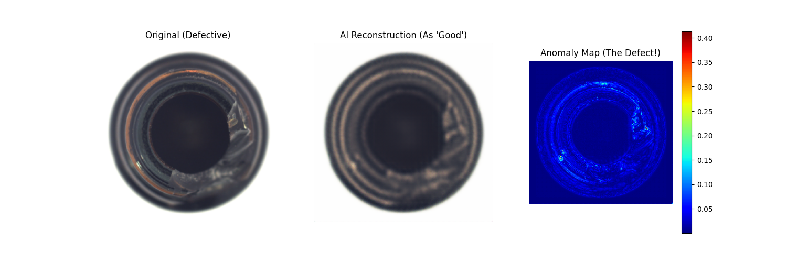

# 工业产品表面缺陷检测系统 (Defect Detection CAE)

本项目是我的本科毕业设计，旨在利用**卷积自编码器 (Convolutional Autoencoder, CAE)** 实现工业产品（如瓶口、金属螺母）表面瑕疵的无监督检测。

## 1. 项目核心流程
- **数据准备**：针对正常样本进行训练，使模型学习到“无缺陷”的特征分布。
- **模型架构**：采用 Encoder-Decoder 结构，利用下采样提取特征，上采样尝试还原。
- **缺陷判定**：通过对比原始图像与重构图像的残差（Residual），定位异常区域。

## 2. 实验结果

*上图展示了模型对破损瓶口的精准定位（红色区域即为识别出的瑕疵）。*

## 3. 如何运行
1. 安装依赖：`pip install torch torchvision matplotlib pillow`
2. 训练模型：`python train.py`
3. 运行检测：`python test.py`

## 4. 算法改进：引入 Batch Normalization
为了提升训练稳定性并加速收敛，本版本在编码器与解码器的卷积层后均引入了 **Batch Normalization (BN)** 层。

- **收敛速度**：从实验结果看，Loss 在前 5 个 Epoch 显著下降。
- **稳定性**：有效缓解了深层网络的梯度消失问题。