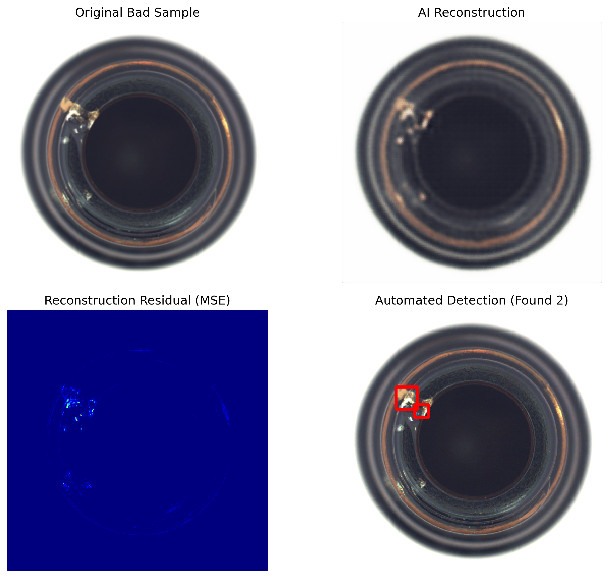

# 工业产品表面缺陷检测系统 (Defect Detection CAE)

本项目是基于**卷积自编码器 (Convolutional Autoencoder, CAE)** 实现的工业产品（如瓶口、金属螺母）表面瑕疵的无监督检测系统。

## 1. 项目结构 (Directory Structure)
为了保证代码的整洁与可维护性，项目采用了如下工程化结构：
- `data/`: 存放原始工业图像数据集。
- `weights/`: 存放训练好的模型权重文件 (`.pth`)。
- `results/`: 存放训练 Loss 曲线及最终的缺陷定位可视化结果。
- `model.py`: 定义 CAE 神经网络架构。
- `train.py`: 模型训练脚本。
- `test.py`: 自动化缺陷检测与画框脚本。

## 2. 实验结果展示

### 2.1 训练收敛情况
引入 **Batch Normalization** 后，模型展现出极佳的收敛速度：

### 2.2 缺陷自动定位效果
通过计算重构残差并结合形态学处理，系统可实现对微小瑕疵的精准定位：

*图：系统自动利用红色边界框标出了瓶口的破损区域。*

## 3. 如何运行
1. **安装依赖**：`pip install -r requirements.txt`
2. **模型训练**：`python train.py`
3. **缺陷检测**：`python test.py`

## 4. 算法改进：引入 Batch Normalization
为了提升训练稳定性并加速收敛，本版本在编码器与解码器的卷积层后均引入了 **Batch Normalization (BN)** 层。

- **收敛速度**：从实验结果看，Loss 在前 5 个 Epoch 显著下降。
- **稳定性**：有效缓解了深层网络的梯度消失问题。
## 实验结果展示

### 自动化检测效果

*注：系统自动识别并利用红色边界框标出了瓶口的破损区域（检测到 2 处瑕疵）。*